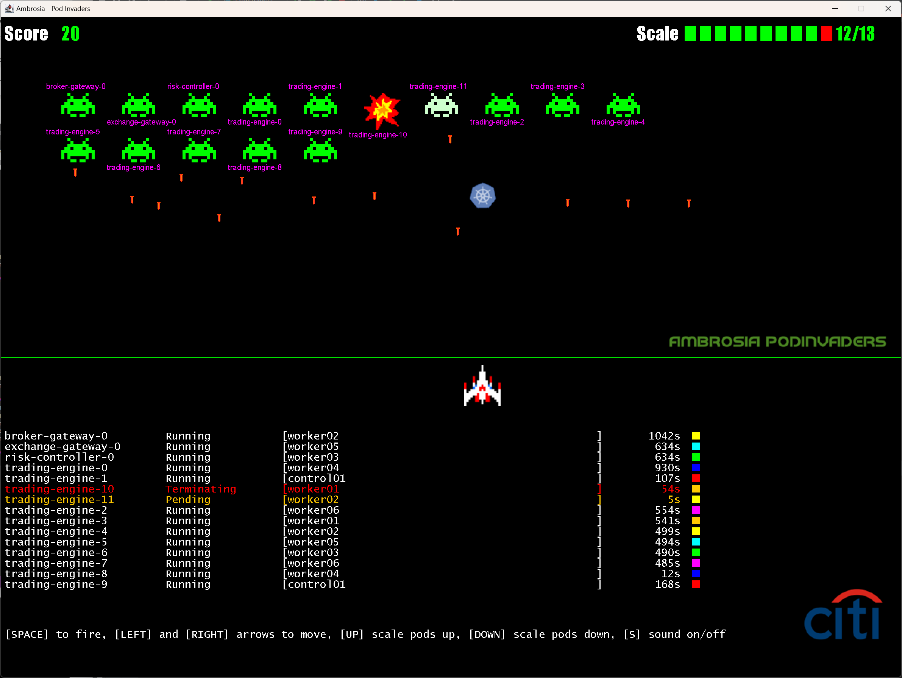

# Pod Invaders

Pod Invaders is a fun way of visualising a Kubernetes cluster and demonstrating its resiliency. It's like the classic
Space Invaders arcade game but the aliens are K8s pods. They can be shot down with a photon torpedo by pressing the
SPACE bar, once hit K8s will bring the pod back to life!

